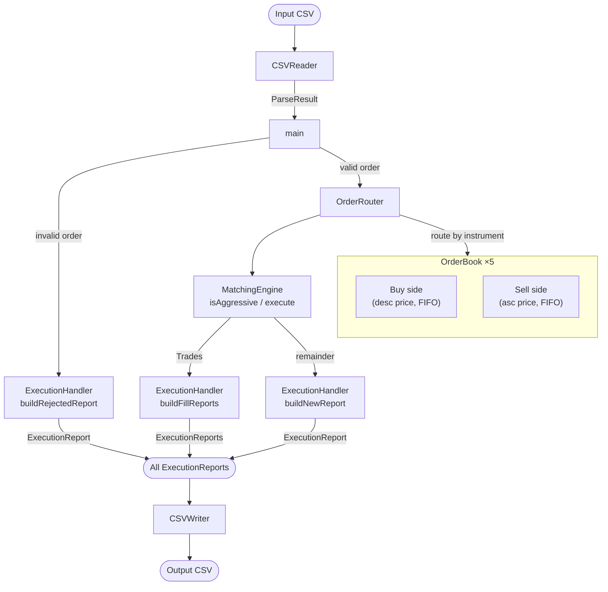

# LillyLedger

A high-performance C++ matching engine for trading flower commodities. This system processes a stream of incoming buy and sell orders, manages a price-time priority limit order book for five specific instruments, and outputs precise execution reports.

## Architecture



## Graphical Interface

LillyLedger includes a fully-featured desktop companion application built with Qt6/C++. It provides tools for visualizing order processing metrics and interacting with the central limit order book.

Features include:

- **Dashboard & Analytics:** Import `orders.csv` files and view execution metrics, including processing throughput and order distribution charts.
- **Order Book Explorer:** Inspect simulated buy and sell depth for specific commodity instruments (Rose, Lavender, Lotus, Tulip, Orchid).
- **Execution Reports Browser:** View granular trades, rejections, and partial fills with integrated table filtering.
- **Manual Order Entry:** Inject single custom trades mimicking client behavior directly into the engine.

## Build Instructions

```bash
mkdir build && cd build

cmake ..

make

# run CLI engine using
./lillyledger

# run GUI application using
./lillyledger-gui

# delete build files using
make clean
```

## Performance

Benchmarked on a release build, averaged over 5 runs.

| Phase  | 10K orders | 1M orders |
|--------|-----------|-----------|
| Parse  | ~5.5 ms   | ~417 ms   |
| Match  | ~7.6 ms   | ~13,452 ms   |
| Write  | ~7.0 ms   | ~718 ms   |
| **Total**  | **~20 ms** | **~14,587 ms** |
| Reports generated | 21,756 | 2,043,990 |
| **Throughput** | ~500K orders/sec | ~68.6K orders/sec |

**Test system:** Intel Core i5-12450H (8 cores / 12 threads, up to 4.4 GHz), 12 MB L3 cache, 16 GB RAM, Linux

## Running Tests

```bash
cd tests && mkdir build && cd build

cmake ..

make

ctest
```
